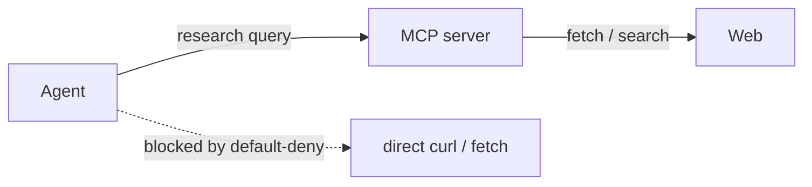
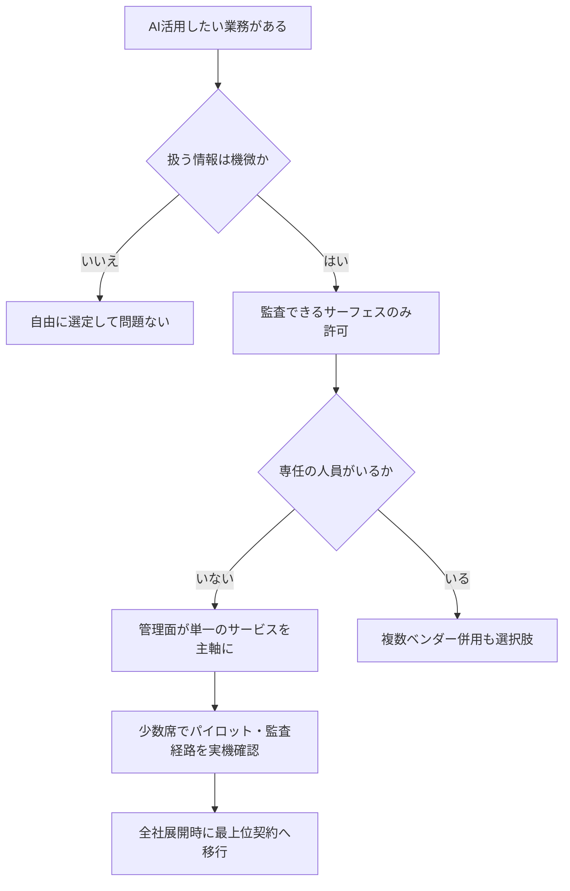

先日、機密性の高い未公開情報を日常的に扱う組織の AI エージェント基盤選定を支援する機会があった。結論を先に共有すると、モデルの性能比較よりも先に「監査ログに何が残るか」で候補が絞られ、最終的に ChatGPT を主軸とする構成になった。この記事はその判断プロセスを、残せた範囲で書き留めたものである。

2026年時点の国内調査では、AI エージェントを導入した企業は全体の約12%、大企業でも半数弱にとどまる。つまり「これから初めて導入を検討する」のは特殊な状況ではなく、大多数の会社の共通する出発点だ。しかもその大半は、AI の設定変更やログ確認を自前でこなせる専任者を持たない。

この記事は、そんな条件セット（機密あり・専任者なし・一般端末）を持つ組織の役に立つことを目指して書いた。同じ悩みを抱える会社では、判断の型ごと使えるはずだ。

なお、特定につながる属性はすべてぼかしている。業種も規模も書けないが、判断の構造はそのまま残した。

## 目次

- [はじめに：3行で結論](#はじめに3行で結論)
- [支援先の制約](#支援先の制約)
- [リスクは2種類ある](#リスクは2種類ある)
- [決め手：監査カバレッジの差](#決め手監査カバレッジの差)
- [管理画面の数は運用リスク](#管理画面の数は運用リスク)
- [課金構造：席代と従量の境界線](#課金構造席代と従量の境界線)
- [コマンド許可リストの限界](#コマンド許可リストの限界)
- [閉域網でリサーチをさせる方法](#閉域網でリサーチをさせる方法)
- [最終的な判断](#最終的な判断)
- [この結論が覆る条件](#この結論が覆る条件)
- [おわりに](#おわりに)

## はじめに：3行で結論

結論を3行にまとめる。

- **監査カバレッジが選定の最優先だった**。Claude Cowork（非エンジニア向けデスクトップアプリ）の操作履歴は、最上位契約でも監査ログ・Compliance API の対象外だった（2026年8月時点、[Anthropic の公式ドキュメント](https://docs.anthropic.com/)に基づく）。
- 同等の用途をカバーする ChatGPT 側（Work / Codex）は Compliance API の対象であり、ここには価格では埋められない差があった。
- 主軸は ChatGPT（Business で少数席パイロット → Enterprise で全社展開）。Anthropic は非機密タスク限定の少数席にとどめる判断とした。

「モデルの性能はどうなのか」という問いへの答えは、実はシンプルだ。現行のフラッグシップモデルはどこも十分に優秀で、差は日々入れ替わる。一方、監査対応と管理機構はプラットフォームの骨格で、契約後に変わることはほとんどない。だから後者を先に評価した、というのが本記事の立場である。

## 支援先の制約

前提となる制約を整理する。特定を避けるため機能的な表現に統一しているが、これは「まだ AI を導入していない会社」の典型的な条件でもある。

| 制約 | 内容 | 選定への影響 |
|---|---|---|
| 情報の性質 | 出す前の情報が動く価額になる資料を日常的に扱う | 監査証跡が必須。「後から説明できること」が最優先 |
| 人員 | AI の設定変更・ログ確認を自前でできる専任者がいない | 管理画面が単純なもの、設定が一度きりで効くものが良い |
| 端末環境 | 一般的な管理対象端末（Windows デスクトップ中心） | デスクトップアプリが動くことが必須。Linux サーバ運用は現実的でない |
| 意思決定 | 全社展開には稟議が必要 | 段階的に拡張できる価格構造であること |

この4つから、評価関数は次のように定まった。

> **性能や機能数よりも先に、「①監査できるか ②管理できるか ③いくらか」の3点で絞る。**

ここを間違えると、契約期間中ずっとその判断を背負い続けることになる。

## リスクは2種類ある

選定の前に、リスクを2系統に分けた。この分類が以降のすべての判断の土台になる。

**1つ目は、構造的に排除できるリスク。** 秘密情報の持ち込み、意図しないファイルへの到達、許可されていないネットワーク接続、承認されていないツール実行——これらは実行環境の隔離・信用境界の設定・各種許可リストという「機構設定」で防げる。一度設定してしまえば、使う人のスキルに依存しない。

**2つ目は、運用規程に頼らざるを得ないリスク。** プロンプトに何を貼ってよいかの判断、生成物の正しさの確認、外部公開前のレビュー。こちらは技術では防ぎきれず、情報区分のルールとレビュー体制に頼るしかない。

専任者のいない組織の弱点は明快で、**2つ目を担う人がいない**ことだ。だから選定方針はこう決まった。「1つ目（構造で潰せる領域）に全振りし、2つ目の負荷を最小化するプラットフォームを選ぶ」

そしてこの方針を突き詰めると、必然的にひとつの問いに行き着く。そもそも、何が監査できるのか？

## 決め手：監査カバレッジの差

両ベンダーのドキュメントを確認した結果がこれだ（2026年8月時点）。

| サーフェス | Anthropic | OpenAI |
|---|---|---|
| chat（Web） | Compliance API 対象 | Compliance API 対象 |
| **非エンジニア向けデスクトップアプリ** | **Claude Cowork: 監査ログ・Compliance API 非対象**（OpenTelemetry 送信のみ） | **ChatGPT Work（デスクトップ）: 対象**（ワークスペースポリシーで統制） |
| コーディング CLI | Claude Code: managed settings + OTel | Codex: requirements.toml + Compliance API（CODEX_LOG 等・保持30日） |
| クラウドエージェント | Cowork cloud（β・非対象） | Codex cloud（対象） |

要点は3つだ。

1. **Cowork の操作履歴だけが監査の外に置かれている。** 会話履歴は端末ローカル保存で、管理者は取得できない。取れるのは OpenTelemetry 経由のイベントだけで、これは Team プランでも使える唯一の経路ではあるものの、Compliance API のような網羅的な監査ログとは役割が違う。
2. **この差はプランを上げても埋まらない。** Anthropic Enterprise（SCIM・カスタムロール・Analytics API 付き）でも、Cowork のアクティビティは対象外と明記されている。つまりこれは構造的なギャップであり、支払額では解決しない。
3. 一方 OpenAI 側は、非エンジニア向けの Work も開発者向けの Codex も Compliance API の枠内にある。監査の視点では「1つの容器に全部入っている」状態だ。

未公開情報を扱う組織にとって「監査できないサーフェスを主軸にできない」という原則は譲れない。この一点で、Cowork は主役候補から外れた。

Claude 自体の能力を疑っているわけではない。単純に、前提と噛み合わなかったというだけの話だ。

## 管理画面の数は運用リスク

次に効いたのが、管理面の単純さだった。

ChatGPT の場合、非エンジニア分は**ワークスペースポリシーという単一の管理層**で統制でき、開発者分は requirements.toml の管理配信に分離される。グループ別ポリシーにも対応しており、部署ごとに強さを変えられる。

一方 Anthropic は、claude.ai の組織設定、デスクトップアプリのトグル、プラグイン市場、Claude Code の managed settings と、**サーフェスごとに管理機構が分散**している。それぞれは合理的な設計だ。しかし専任者のいない組織では、「設定が散らばる」こと自体がリスクになる。設定漏れ・変更忘れ・棚卸しの不在は、攻撃面より先に事故を起こす。

ホワイトリストの粒度も違う。CLI はファイル・ネットワーク・sandbox まで強制できるのに対し、デスクトップアプリは「組織トグル + コネクタ承認」程度までしか絞れない。この粗さは仕方がないとしても、せめて管理画面は1つであってほしかった。

## 課金構造：席代と従量の境界線

価格は選定の3点目。両社とも「席代 + 従量」の2成分だが、境界線の理解にはズレやすい箇所があった。

| プラン | 料金 | 統制・監査 |
|---|---|---|
| ChatGPT Plus | $20/月 | デスクトップ版 Work 利用可（2026-07-09〜全プラン開放）。管理面はほぼ無し |
| ChatGPT Business | $25/席/月・$20（年払い） | SSO・管理コンソール・Policies。学習不使用 |
| ChatGPT Enterprise | 個別見積 | ZDR・CMK・HIPAA・Compliance API |
| Claude Team Standard | $20/席/月（年払い）・$25（月払い） | SSO/JIT。SCIM・Compliance API 不可 |
| Claude Enterprise | $20/席〜 + API 従量 | SCIM・カスタムロール。ただし Cowork activity は対象外 |

確認して明確になった点は以下の通り。

- **組織プランは常に「席代（定額サブスク）+ エージェント従量」の2成分。** 個人プランの使い放題型は適用されない。
- chat / Work 本体の利用は席代だけで完収する。従量が乗るのはエージェント（Codex 等）のベースライン超過分だ。非エンジニア中心の導入なら、初年度は「席代固定 + 従量ほぼゼロ」で収まり、コスト予測が立てやすい。
- Enterprise の席単価は非公開のため個別見積。見積時には ①最低席数 ②Compliance API / ZDR / 日本リージョンの範囲 ③Codex 従量のワークスペース月次上限の設定可否、の3点を確認したい。

※料金は2026年8月時点の調査値。改定が頻繁な領域なので、契約時には必ず再確認すること。

## コマンド許可リストの限界

ここからは少し技術的な話。AI エージェントの統制として真っ先に挙がるのが「実行を許すコマンドのホワイトリスト」だが、検討の過程で重要な限界が分かった。

Bash は任意の文字列を実行できる。この性質上、許可ルールはシェルラッパーや変数展開で**構造的に回避できる**。`devbox run` や `npx` のようなラッパー、シェル変数、パイプの組み合わせ——許可リストの文字列マッチは、こうした抜け道をすべて塞げない。つまり「コマンド許可リスト = 安全装置」という設計は成立しない。

代わりに効くのは**到達制限**だ。

- ファイルシステムの隔離（どこに触れるかを限定）
- ネットワーク出口の default-deny(どこに繋がるかを限定)
- sandbox の強制（OS レベルの拘束）

「何を実行させるか」より「どこに届くか」を狭める方が、文字列マッチの穴を塞ぐ労力より安い。この知見は次のネットワーク設計に直結する。なお、OS レベル sandbox が存在するのはローカル CLI のみで、デスクトップアプリ側は VM / クラウド実行という別の隔離モデルになっている。

## 閉域網でリサーチをさせる方法

ネットワークを default-deny にすると、今度は「調べ物ができない」という矛盾が生じる。資料作成には Web リサーチが付き物だからだ。

解法として採ったのが、検索・ページ取得を **MCP サーバ経由に集約する**方式だった。

ネットワーク許可は LLM API と MCP API の2〜5エンドポイントに保ちながら、Web への広い到達は MCP 側に任せる。組み込みの fetch / search は deny、curl / wget 系のコマンドも deny。こうすると「外に出られる口」が物理的に減り、監査すべきログも MCP 呼び出しのパラメータ（query / url）に集約される。

注意点はコストだ。従量制の MCP プロバイダを使う場合、並列エージェントで大量リサーチさせると課金が伸びる。月次上限は最初から掛けておくべきだろう。

## 最終的な判断

以上を踏まえた判断フローがこれだ。

結論として、この構成に落ち着いた。

- **主軸： ChatGPT。** Business 数席でパイロットし、Compliance API の実際の取得経路と保持期間を自分の手で確認する。要件が固まったら Enterprise（ZDR・CMK・日本リージョン込み）へ。
- **併用： Anthropic は非機密の公開情報タスクに限定した少数席。** Cowork は監査ギャップが解消されるまで、規制対象業務から外す。
- **除外： 監査対象になり得る業務での Cowork 利用。** 読み取り中心の定型業務に限定するなら OTel 先行設計を条件に許容、という線引きだ。

## この結論が覆る条件

なぜこの結論でよいのか、その根拠と限界を書いておく。この結論は条件付きであって、以下が変われば再評価する。

1. **Anthropic が Cowork を Compliance API 対象にしたら。** 最大の不確実性はここだ。対応されれば「Claude の複雑タスクの品質 + 監査対応」が揃い、対等以上の候補に戻る。四半期ごとの仕様確認で最初に見る項目。
2. **社内が Google Workspace 深度依存になったら。** chat 面（RAG・検索連携）は Gemini も現実的な候補になる。ただしエージェント面の完成度では Work が先行しており、「chat は Google、エージェントは ChatGPT」の住み分けはあり得る。
3. **Enterprise の予算が通らなかったら。** Business で OTel / プロキシログ代替という妥協案は存在するが、監査証跡の弱さは後から効いてくる。削る優先度は低い。

逆に言えば、これ以外の要素——モデルのベンチマーク差や新機能の追加ペースなど——は再評価のトリガーにしない。日々変わるものを判断軸にすると、選定が終わらないからだ。

## おわりに

要点を繰り返す。

- 初めて AI エージェントを導入する組織の大多数は、専任者なし・機密あり・一般端末という同じ制約セットを持つ
- その場合、判断軸は「監査できるか / 管理できるか / いくらか」の3点に収束する
- 2026年8月時点では、非エンジニア向けデスクトップアプリの監査カバレッジに構造的な差があり、それが主軸選択を決めた

本記事は選定プロセスの記録であって、全社展開後の実測データはまだ無い。パイロットの結果（監査経路の実機確認・従量コストの実測）は、英語版シリーズとして [agentjournal.dev](https://agentjournal.dev/blog/enterprise-agent-selection/) に追記していく予定だ。

同じ制約（機密あり・専任者なし）で AI 導入を検討している方の判断軸や、逆に「そこは見なくていい」という反論があれば、ぜひコメントで教えてください。特に「監査対象外のサーフェスをどう運用しているか」の事例は、他の読者の参考にもなるはずです。あなたの会社なら、最初の1台を何で決めますか？
